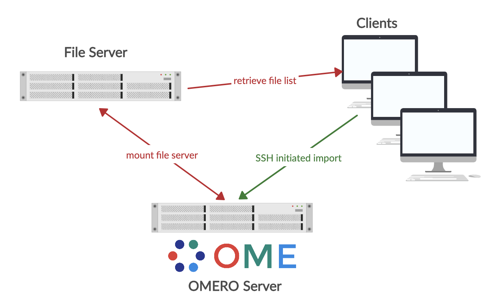

# Readme
This python script is still in beta state. The functionality should be provided, but error handling and some extra features are not implemented yet.

## Background
This is a python based GUI for OMERO Inplace import workflows. The tools provides a simple GUI for the regular user to enter files to the OMERO server without the need to copy the binary pixel data to the server. The original binary pixel data is kepped on a central file server, that is accessed from both the OMERO server and the client used to start the import. This is done following the inplace import szenary described here: https://docs.openmicroscopy.org/omero/5.6.1/sysadmins/in-place-import.html. The tool then generates a bulk import yaml file together with a second file containing the file list of images to be imported. This is done according to: https://docs.openmicroscopy.org/omero/5.6.1/users/cli/import-bulk.html.

{:width="480px"}

## Prerequest
The server must have a permanent mount point of the file server. User righs must be set so that the omero system user as well as the inplace user have access to the image files to be loaded. Additionally an inplace user must be set up on the OMERO server that has full read/write access to the OMERO/ManagedRepository. This is described in detail here: https://docs.openmicroscopy.org/omero/5.6.1/sysadmins/in-place-import.html. 
Also make sure that the environmental variables for the inpalce user are set correctly and that the environemntal variables are available when loged in via SSH (e.g. add to .bashrc, before the interactive check).

## Installation
On the client a pyhton3 environment is required. Additionally the following libraries are required.

* omero-py
* PyQt5
* PyYAML
* paramiko

Suggested installations use a virtual environment setup like this:

```
python3 -m venv omeroipi
. omeroipi/bin/activate
pip install omero-py==5.6.0
pip install PyQt5
pip install PyYAML
pip install paramiko
```
Also download the OMERO Server distrubtion and add the $OMERODIR to enable command line import as described here: https://docs.openmicroscopy.org/omero/5.6.1/users/cli/installation.html.

Download the omeroipi.py together with the IPI_icon.png as well as Omero_logo.png to your virtual environement.

## Usage
To start the GUI of the inplace importer type inside your venv:

```
python omeroipi.py
```
This will open the GUI that looks like this:


