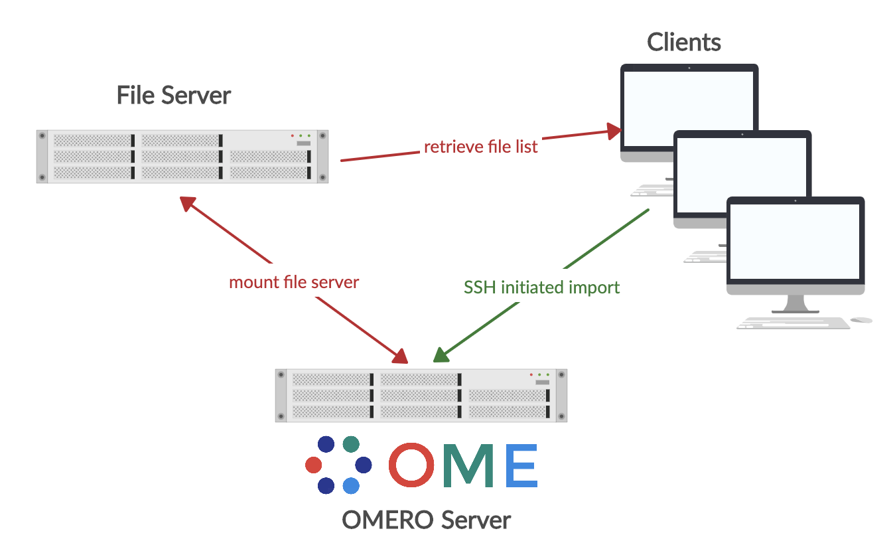
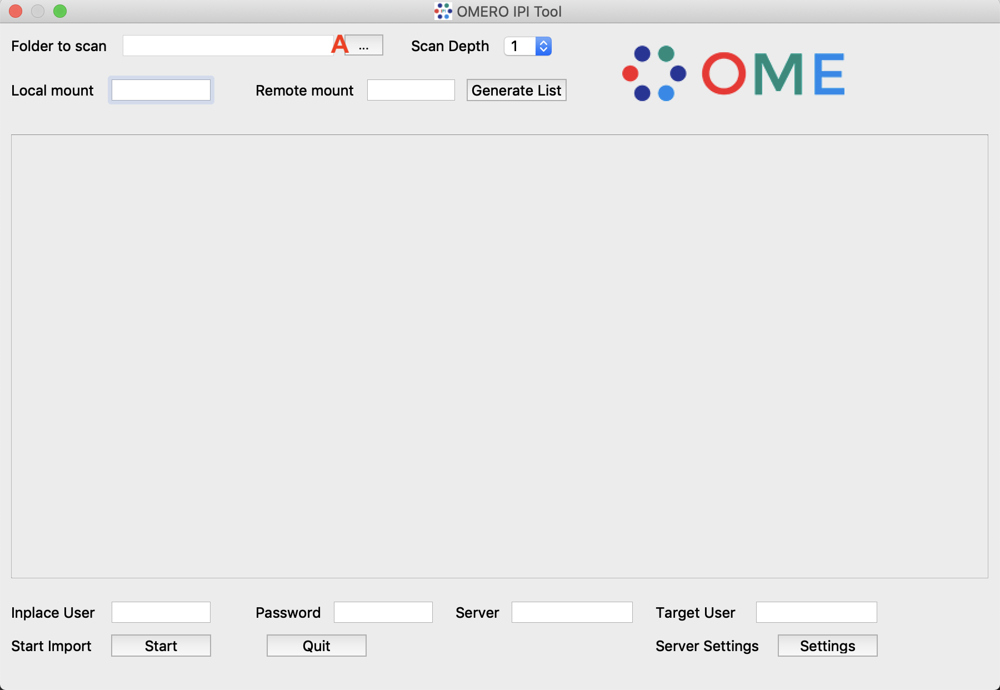
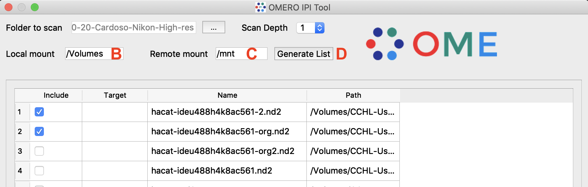
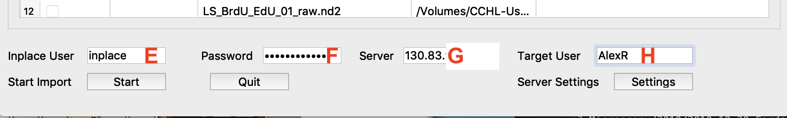
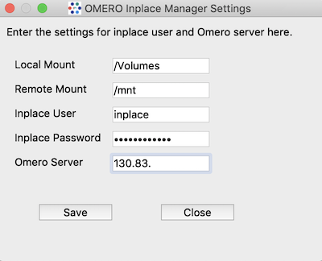

# Readme
This python script is still in beta state. The functionality should be provided, but error handling and some extra features are not implemented yet.

## Background
This is a python based GUI for OMERO Inplace import workflows. The tools provides a simple GUI for the regular user to enter files to the OMERO server without the need to copy the binary pixel data to the server. The original binary pixel data is kepped on a central file server, that is accessed from both the OMERO server and the client used to start the import. This is done following the inplace import szenary described here: https://docs.openmicroscopy.org/omero/5.6.1/sysadmins/in-place-import.html. The tool then generates a bulk import yaml file together with a second file containing the file list of images to be imported. This is done according to: https://docs.openmicroscopy.org/omero/5.6.1/users/cli/import-bulk.html.



## Prerequest
The server must have a permanent mount point of the file server. User righs must be set so that the omero system user as well as the inplace user have access to the image files to be loaded. Additionally an inplace user must be set up on the OMERO server that has full read/write access to the OMERO/ManagedRepository. This is described in detail here: https://docs.openmicroscopy.org/omero/5.6.1/sysadmins/in-place-import.html. 
Also make sure that the environmental variables for the inpalce user are set correctly and that the environemntal variables are available when loged in via SSH (e.g. add to .bashrc, before the interactive check).

## Installation
On the client a pyhton3 environment is required. Additionally the following libraries are required.

* omero-py
* PyQt5
* PyYAML
* paramiko

Suggested installations use a virtual environment setup like this:

```
python3 -m venv omeroipi
. omeroipi/bin/activate
pip install omero-py==5.6.0
pip install PyQt5
pip install PyYAML
pip install paramiko
```
Also download the OMERO Server distrubtion and add the $OMERODIR to enable command line import as described here: https://docs.openmicroscopy.org/omero/5.6.1/users/cli/installation.html.

Download the omeroipi.py together with the IPI_icon.png as well as Omero_logo.png to your virtual environement.

## Usage
To start the GUI of the inplace importer type inside your venv:

```
python omeroipi.py
```
This will open the GUI that looks like this:



Select the folder on the mounted file server that contain the images to be imported in OMERO. You can also set the scan depth for number of subfolders to be included (A).
This will invoce the command 
```
omero import -f
```
on the selected folder and a list of all supported files will be generated and listed as shown below.



Now enter the part of the path on your local mount point that needs to be replaced with the remote mount point (B and C). The logic behind this is that the entered local mountpoint string is replaced with the remote mount point, so that the result is a valid path to the intended files. After pressing "Generate Lsit" (see below) you can check if everything is correct by looking at the temp.tsv file generated in your local temp folder on the client. You can also select and unselect individual files in the presented tables. Add a dataset name in the second column for the files to be imported.

Next press Generate List (D). This will compose a bulk.yaml and a ipifilelist.tsv with the provided details in your local temp directoy.

Finally provide the user name and password of the OMERO inplace user (E and F) as well as the servers IP or name (G) and the Omero user name for which the import should be performed (H).



Press Start to initialise the import. For that the bulk.yml and ipifilelist.tsv are uploaded to the server and a bulk import is started using a SSH command from the inplace user. Depending on the amount of data to be imported the OMERO IPI Tool will show activity for some time.

In order to facilitate the import for regular users the OMERO system admin can provide all the settings. This is done by clicking "Settings" so a new window will open. Here again the same settings can be entered and saved.



If you save the settings a local file ("ipisettings.p") will be created with all the local settings. ATTENTION, this includes also the password for the inplace user!. The next time you start the GUI it will scan the local folder for the presence of the ipisettings.p file and if present will automatically load the settings and fill the fields.

